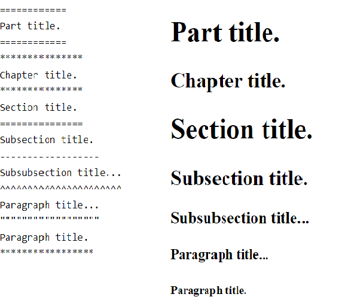

==============
Best practices
==============

.. role:: highlighttext
   :class: highlighttext

A standard makes sure that all the developers working on the project are following certain specified guidelines. Formulating the code helps in easy understanding and maintenance of the code, and hence enhanced efficiency.
It largely reduces the interdependence between modules and aids in better error handling.

Below are certain aspects of best practices one should adhere to when developing scripts.

Idiomatic code
==============

One of the biggest advantages of writing idiomatic code is that, **it greatly improves the readability of the code**, there by making it easier to maintain. Also, it helps in learning the language and explore the features better.

.. note::
    Here are the links to the basics of idiomatic code

    1. `<https://docs.python-guide.org/writing/style/>`__
    2. `<https://pep8.org/>`__

Code Testing
============

A test case is a set of conditions which is used to determine whether a system under test works correctly. 

While below there are details on code testing, very broadly our approach for testing is:

  * Styles tests are mandatory to ensure comprehension.
  * All functions exposed to consumption must be unit tested
  * Functional tests are needed for code pipelines that are expected to be put in production.
  * Integration tests are needed for all downstream outputs and external upstream sources such as flatfiles, web-services.
  * Regression tests can be considered to reduce cumulative maintenance efforts.
  * Installation tests for code packages and property tests for complex logic is recommended.

What should I test ?
--------------------

Here are some guidelines:

  * Write ``style`` tests. These are tests that ensure the coding standards and guidelines are being followed for your project using tools like ``flake8``. These are trivial to setup and significantly improve the quality of your code. These should be required in every project.

  * Write ``unit`` tests. These are tests for individual functions in your code. It is a good idea to start with unit tests for the API that the end-users use the most. Ideally, you want to test most of your ``public`` API. These tests typically use synthetic data and/or examples that are included with the tests.

  * Write ``functional`` tests. These are tests for common user workflows in your code. For instance, tests to run through the data ingestion, training and the inference workflows. Ideally, you want to use realistic data for these tests that might require some set up before running the tests.

  * Write ``integration`` tests. These are tests to ensure compatibility with external (to your code) services upstream/downstream of your component. These could be accessing some external databases or web-services or even formatted file outputs. The tests are an excellent way to document the agreed upon specification for these interfaces. For instance, if a formatted output is expected, a test verifying the output for that format would be a living document for the specification of the expected formatting.

  * Write ``installation tests`` tests. These are tests to ensure that your library or application has been installed correctly on the target system. You can start with a test that just checks the necessary imports, folders and other files required for your code to run. If you have created a test suite, they can be made available for the user to run and test as an additional check.

  * Consider writing ``regression`` tests. As folks start using your code, they will invariably run into bugs or problems and report them. It is a good idea to write a test to reproduce the bug and add it to the test suite as part of fixing the bug. These tests ensure that you don't reintroduce a bug that was already fixed earlier and ``regress`` (and thus the name for these tests) the software.

  * If time permits, consider writing ``property`` tests for chosen functions that are critical and/or have complex logic. These are essentially ``unit`` tests but you don't test your code for specific examples (i.e. known inputs and outputs) but instead try to check some generic facts or invariants that hold for your function given an input. Consider the functions to save and load a dataframe. Now, the actual values in the dataframe themselves are not important but we want to ensure that the operations are reversible, i.e. ``load_data(save_data(df))`` should be identical to the original dataframe ``df``. These tests are powerful because we can randomly generate a lot of examples automatically and still verify that the ``property`` holds. `Hypothesis <https://hypothesis.readthedocs.io/en/latest/index.html>`__ is a python library that provides this capability and can also be used to generate random data examples for ``numpy`` and ``pandas`` datastructures.

**Advice**

  1. Prefer using library functions from the standard library and vetted third-party libraries (e.g. ``Pandas``, ``Numpy``, ``scikit-learn``) to rolling your own code unless absolutely necessary. These libraries are used by a lot of folks and are usually well tested and are implemented with performance in mind.

  2. Set up the ``style`` tests right at the beginning of your project. This ensures that the entire team follows the coding standards and guidelines right from the beginning.

  3. Make it easy to run these tests. Provide some automation scripts to quickly run the tests. ``pytest`` has a `lot of options <https://realpython.com/pytest-python-testing/#durations-reports-fighting-slow-tests>`__ to speedup your testing process.

  4. Automate the process. Add a ``CI<>_`` to your project if possible. These are services that monitor your version control repository (e.g. ``GitHub`` repo) and run some scripts that you provide on certain events. For instance, you can configure it to run a shell command every time a commit is pushed to the remote repository. We can use these services as part of the code-review process to ensure that the required tests are run automatically and the reviewer can focus on non-trivial issues.

  Very few CI services offer free-tier for non open-source projects and windows support. If you are on ``GitHub``, then ``GitHub Actions`` is an integrated CI service that can be used, and ``CircleCI`` is another good option. Note that the free-tier option provides limited compute hours per month. If your CI takes too long to run, that can slow down the process for you and others sharing the CI service. So avoid running CI for every single commit (often the practice if you have paid plan). A good default here is to run CI on new PRs and when a closed PR is re-opened. This ensures that all PRs automatically run the tests when created and we can easily re-run the CI when required by simply closing and re-opening the PR.

  5. Focus on ``style`` and ``unit`` tests during the development phase. As you start working on deployment to production, start focusing on ``integration`` and ``regression`` tests.

How to approach testing in your project ?
-----------------------------------------

  1. Remember the 80-20 rule and the age old adage of `Don't let perfect be the enemy of good`.

  1. Start with ``style`` tests for your project. There will be a one-time effort to standardize your existing codebase. Now, ``flake8`` will highlight a lot of errors and it might seem daunting to have to fix all those errors. Note that there are only a few classes of errors (the error code printed by flake8) and you can ask ``flake8`` to ignore specific classes by passing it as an option. A good first step would be to use code autoformatters like ``black`` and ``isort`` to automatically reformat your code. Then, add a test case to run ``flake8`` and interactively add classes to ignore for unimportant errors and fix any important issues. This does not take much time and gets you almost 60% to your end goal.

  2. Use ``pytest`` to add tests for some commonly used and/or critical functions in your code. For instance, if you have a non-standard custom metric to evaluate your model, that would be a good function to have exhaustive tests as it is critical to your whole project. Similarly, testing data validity (schema, data distributions, missing values, outliers etc) at different stages of your processing pipeline would be a very useful set of tests.

  3. When writing ``unit`` tests, start with simple example based tests. You can use `pytest features<https://docs.pytest.org/en/stable/parametrize.html>_` to run your tests on a well defined set of examples. For functions that have complicated logic (e.g. many edge cases are possible), consider using ``Hypothesis`` library to automatically generate a large number of examples and run ``property`` tests on them.

  4. When you start sharing your code with external users and/or looking into production environments, it is good to add some ``installation tests`` and ``integration tests`` to ensure the code has been installed and configured properly. These are very useful when trying to debug issues related to environment, access and/or configuration.

  5. Throughout the project, as and when you encounter bugs and fix them in the code, add a ``regression`` test to ensure it doesn't occur again.

How to write test cases ?
-------------------------

.. note::
    Go through the links below for more detailed test case generation:

    1. `Overview of testing in Python <https://docs.python-guide.org/writing/tests/>`__
    2. `A detailed tutorial on testing from basics to modern tools <https://nedbatchelder.com/blog/202002/getting_started_testing_with_pytest.html>`__

FAQ
---

1. Tests will take away time from development efforts ?

The purpose of the test cases is to raise the quality of the code and help the developers be more productive by increasing your skill and cutting down the time spent on manual testing. If done right, integrating automated testing in your project should reduce the overall development time and produce higher quality deliverables.

Code Review
===========

Code review is the practice of asking your peers and/or a mentor to review a 
piece of code developed by you. This is a very important process to include 
in your day-to-day workflow as it significantly reduces the chances of a bug
slipping by and improves overall quality of the code. It is also a great way
for developers to learn from each other and ensure a common standards and'
style in the code base.

* Avoid, over-the-shoulder, email & pair programming as review methods.
* Before starting to code, design your code and concur with your reviewers.

.. note::

   The discussion below assumes you are using ``GIT`` for version control and
   ``GitHub`` for hosting the git repository and collaboration. There are other
   hosting platforms, e.g. `BitBucket` or `GitLab`, but they all have very 
   similar features to ``GitHub`` and the recommendations below apply to those
   as well.

   If you have an alternative setup, please see the :ref:`review-faq-ref` section
   for some alternatives.

Tools for review and collaboration
----------------------------------

Shared version control is a pre-requisite for an effective code-review process.
``GitHub`` is a hosting platform for ``Git`` repositories and tools for a team
to collaborative work on the repository.

The ``GitHub`` platform provides authentication and authorization for your shared
repositories to ensure only team members with appropriate permissions can perform
certain operations.

There is also an `Issue Tracker <https://guides.github.com/features/issues/>`_ to help track feature or 
change requests for your project. This allows the entire team to work collaboratively online using
``GitHub`` issues to discuss the request and scoping out the details of a task.
This makes the whole process democratic and open to the entire team. As the discussions
happen on the platform and are archived, you always have a chronological record providing
context for the various decisions made throughout the course of the project.

``GitHub`` provides one other important tool for collaboration focused around 
making code changes to the repository and code review called `Pull Requests (PR) <https://docs.github.com/en/free-pro-team@latest/github/collaborating-with-issues-and-pull-requests/about-pull-requests>`_.
Essentially, once you create a ``Git`` branch containing your changes and push it to the 
repository, you can initiate a ``PR`` workflow to request feedback from one or more team
members. ``GitHub`` provides the tools to do create the ``PR`` and an interface to be able
to review the changes and provide comments and have a discussion. Again, all the collaboration
happens on the platform and the discussions are archived for future reference.

Here are some useful references on ``GitHub`` workflows:
    * `10 minute handbook on Git and GitHub <https://guides.github.com/introduction/git-handbook/>`_
    * `Guides on working features in GitHub <https://guides.github.com/>`_

**Advice** on configuring your ``GitHub`` repository
----------------------------------------------------

Here are some pointer on the use of these tools:

1. Decide on a ``Git`` workflow. 
   
   A typical approach is `trunk-based development <https://trunkbaseddevelopment.com/>`_. In this model, you have a main branch (often called ``master`` or ``trunk``) that is the latest stable version of your code. Team members create `short lived` branches from your main branch and merge their changes back to the main branch.

2. Use the Issue tracker to track feature request, bugs and design discussions in your project.
  
   If you are not using an ``Issue Tracker`` for your project, please consider using the default tracker provided by
   ``GitHub``. The ``GitHub`` issue tracker has very useful features to `effectively manage your project <https://docs.github.com/en/free-pro-team@latest/github/managing-your-work-on-github/managing-your-work-with-issues>`_.

3. :highlighttext:`Enable branch protection`.
  
   Set up access control so that team members have sufficient privileges to get their work done but no more. Restrict tricky parts of the workflow to senior team members to avoid breaking ``master``. For instance, allow every team member to raise a ``PR`` but allow only a few team leads to be able to merge the PRs to the ``master`` branch. Another access policy could be to disable pushing directly to the ``master`` branch.

   Once the policies are set up, ``GitHub`` will automatically enforce these policies and provide a safer environment for your team members by preventing accidental/unintended changes to the repository.

4. Contribute your code changes using ``Pull Request`` mechanism.

   `Creating a Pull Request <https://docs.github.com/en/free-pro-team@latest/github/collaborating-with-issues-and-pull-requests/creating-a-pull-request>`_ is the recommended way to propose changes to code and conduct a code-review.

5. :highlighttext:`Set up a CI system` to automatically run tests when a PR is created.

   ``Continuous Integration`` is the practice of automatically running running a suite of tests on a repository branch to check if it is safe to push into production. The idea is that we ``continuously`` check branches for production worthiness and fix any problems. This goes well with the ``trunk`` based ``Git`` workflow in ensuring the
   main branch is always ready to deploy to production.

   ``GitHub`` provides a free-tier for ``CI`` called `GitHub Actions <https://docs.github.com/en/free-pro-team@latest/actions/learn-github-actions/introduction-to-github-actions>`_ that offers an easy way to get started and add ``CI`` capabilities to your project. A good start is to automatically run your tests everytime a ``PR`` is raised.

**Advice** for the developer 
----------------------------

Doing a good code review takes time and effort on the part of the reviewer. It is in your best interest to engage the reviewer and get useful feedback on your PR. Actively try not to not take any review comments personally or be defensive about your implementation. If you disagree with a comment or a suggested fix, try to understand the reviewer's point of view and have a discussion around the merits and demerits of the approaches. You can ask someone senior to mediate an issue if you cannot come to an agreement. Treat every PR as an opportunity to learn more.

Remember that your team members are busy as well, and may not immediately provide feedback. Typically, you should expect to get a review the same day but sometimes it can be longer depending on the reviewer. Expect and be prepared for a few iterations of review and feedback before it is finally approved by the reviewer. So it is in your best interest to make it as easy and convenient for the reviewer to review and approve your PR.

Here are some recommendation for a ``GIT`` based development workflow for your day-to-day work:

    1. Create an ``Issue`` in the ``Issue tracker`` before starting any work that requires changing code in the repository. The issue should capture the requirements of a task. Say, you need to add a new feature or fix a bug in the code. You start by creating a new ``Issue`` if one doesn't already exist and describe the feature or the bug in some detail.

    2. Once you create an issue, create a branch to work on the issue. It is often a good idea to use the issue id as part of the branch name. A good convention to follow is to name your branches as ``<fix-type>/<issue id>/<short moniker>``. Here, ``<fix-type>`` indicates the type of code change:

            * enh - enhancement
            * feat - new feature
            * fix - a bug fix
            * doc - a documentation update
            * test - update tests

    Here are some example branch names, see if you can guess the intent of the code changes in the branch

            * enh/issue#100/support-s3
            * fix/issue#200/missing-config
            * doc/issue#32/update-dev-guide
 
        As you work on your project, you will accumulate a lot of branches. You don't want to delete your local branches as ``GIT`` keeps them out of your way and its good to have them in case you need them later. The above scheme helps you organize and search your branches effectively.

    3. As you start working on your feature or bug, it often helps to start with a test case. For bugs, the test should fail and then you start working on a fix to get the test to pass. For a new feature, you can write tests to mock out its behavior. This is called Test Driven Development (TDD) and is a good way to streamline your development process.

    4. As you work, make small logical commits and push to the remote repository frequently. This ensures that you don't lose your changes if you lose your local copy by accident. Use short useful commit messages as these can be helpful when you look at the log/record of all the changes done. Consider using the ``<fix-type>`` labels to express the intent of a commit. Note that the commit messages have an active voice. This is a typical convention followed by many projects and is a good practice to adopt. Here is an example short commit messages:

        * ENH: Support S3 backend for file storage.
        * BUG: Fix test failure due to incorrect path manipulation.
        * DOC: Fix typo in developer guide
        * TEST: Add tests for S3 backend support.
        * CLN: Format code
        * MAINT: Update scikit package dependency to latest version.

    5. Once you are ready to share your changes with the team, verify that you have followed coding standards and style guidelines as followed by your team.

    6. Before creating a PR, sync your local repository with remote repository using a ``git pull``. If the master has changed since you created your branch, you have one of two options:

        * Do a ``git rebase`` on top of the latest master. This will apply all your changes one-by-one using the updated master and give you an opportunity to fix any conflicts.
        * Merge the latest master **onto** your branch and fix any conflicts. Once fixed, push your branch again.
                
    7. Create a PR with a meaningful title and a good description. The title should clearly convey the intent of the PR. The description should atleast have details on 

        * The contributions from the PR
        * Any implementation/design choices made
        * Reference(s) to the issues and/or other PRs that might be related to this.

    Here are some pointers on ``PR``:

        * `Github article on "How to write the perfect pull request" <https://github.blog/2015-01-21-how-to-write-the-perfect-pull-request/>`_
        * `Thoughtworks article on code-review <https://github.com/thoughtbot/guides/tree/master/code-review>`_
                
    8. Before you assign a reviewer, take a look at the diff view showing the changes from the PR and review it once and fix any glaring issues. Also, verify that the CI tests pass. Now, request a review from your team members.

    9. Note that you don't have to wait until you have completed everything to open a PR. Sometimes, it is very useful to get early feedback on your approach before you go too far down the wrong road. In such cases the convention is to add a prefix ``[WIP]`` (Work In Progress) to indicate that the PR is not yet complete. You can ask a team member for a review and be specific about what you are looking for. Once you are done and ready for a final review, ensure all the requirements in the previous step are taken care of and remove the ``WIP`` prefix and request a review.

**Advice** for the code reviewer
--------------------------------

Consider PR reviews to be both learning and teaching moments and invest the time to do it well. A namesake review pointing out a few obvious issues and calling it a day might seem productive but is harmful in the long run. Particularly, for important PRs, plan to spend a good amount of time reviewing the PR. Avoid harsh language, maintain a friendly tone and provide suggestions rather than simply pointing out flaws in the code. 

Here are some specific things to look for in a code-review:

        1. Title and description. Does the title and description (and any references in those) give you enough context on the the following:

            * What does this PR contribute ?
            * Why is this change needed ?
            * What are the design decisions made in this PR ?
                
        2. Ensure basic standards are followed

            * There are adequate number of tests for the changes.
            * CI runs successfully
                
        3. Check for any inappropriate files in the PR

            * Sensitive information (credentials and/or secrets) that should not be committed to the repository without encryption.
            * Binary files that are not to be part of the repo : pyc files, build files, 
            * Data files, particularly large files or frequently changing, should not be part of the repository
                
            When you find these issues, ensure that these file patterns are added to `.gitignore`.

        4. Check for general non-idiomatic use of the language features. These include but not limited to:

            * bad variable names: suggest alternative names
            * hardcoded constants: consider if they should be module level constants
            * dead code : should be removed
            * missing/invalid docstrings : suggest improvement
            * inappropriate datastructures : point these out and suggest alternative
            * inappropriate error handling : point these out and suggest alternative
                
        5. Suggest opportunities for improving the code. For instance:

            * repeated code blocks : perhaps refactor into a function
            * appropriate log statements : improve the logs
            * global variables : see if they are really needed. Suggest alternative.
            * complex logic : understand the intent and suggest alternative
            * error handling : suggest places where error handling might be appropriate
            * tests for new functionality. If a bug, a regression test that catches the original bug.
            * check if tests are reasonably complete:

                - check both the happy path and the edge cases including errors
                - check the tests are modular: a test should test one thing.
                - ensure data required by test if available

            * check if any documentation needs to be updated

        6. Consider the impact of the current change WRT performance, maintenance. Raise any concerns. 

.. _review-faq-ref:

FAQ
---
**1. What are alternatives to GIT for version controlling?**

Often times, the org is concerned about hosting the code outside their infrastructure. 

If you absolutely cannot use ``GIT``, then you can maintain code folders in shared storage (e.g. NFS, GDrive, MS Teams etc.) and follow a strict change process to update the code folders.

One option could be to have a reference folder which would be the source of truth and editable by only a few team members by readable by all. Team members can download the reference folder, make a copy for editing and make their changes to the copy. They can use external tools to compare the two folders and generate diff views for review by the team. Once review process is completed, team members with write access are responsible for updating the reference folder.

**2. Isn't creating an issue/ticket for every feature request (or bug) too much overhead?**

Not really. It doesn't take much time to create one. The time spent writing a good issue description is time spent towards better understanding of the requirements and the 
deliverables. Any confusions can be clarified on the issue discussion thread along with assumptions and constraints. The issues are archived and the entire thread is available for review
any time for the entire team.
  
**3. Aren't these long branch names are hard to type everytime I use the CLI?**

The ``GIT`` CLI tool supports tab-completion and if you are using a UI, then this is not even a problem.

**4. What if I don't have an issue for the work I am doing?**

Please create one and use that. If that is not possible or desirable for some reason, skip the issue-id in the branch name.

**5. What if my PR addresses multiple issues?**

This is generally not preferred. Ideally you want one PR for one issue but sometimes you are in a hurry and you just want to fix a bunch of tiny issues in a single PR. 
In this case, drop the issue id from the branch name.

**6. How to use git for reviewing notebooks?**

The usual tools for reviewing code are not effective with the usual notebook files (``.ipynb``) as these files have a lot of metadata in addition to the code. If possible, consider getting a subscription to `ReviewNB App <https://www.reviewnb.com/>`_. This has integrations to your hosted version control platform and provides an interface for reviewing notebooks that is very similar to the usual code review interface.

If this is not possible, then you can install the open-source library `nbdime <https://nbdime.readthedocs.io/en/latest/>`_ to be able to view diffs of notebooks on your local machine. See `Installation and usage <https://nbdime.readthedocs.io/en/latest/index.html#contents>`_ for instructions on configuring the tool to work well with other tools in your workflow.

  
References
----------
    - `Git Best practices <https://sethrobertson.github.io/GitBestPractices/>`_
    - `Google code review guides <https://google.github.io/eng-practices/review/reviewer/>`_

Packaging
=========

It is necessary to package the code to share it with developers. It is easy for other developers to download and install your package either for casual experiments, or as part of large, professional systems.

.. note::
    `Here <https://python-packaging-tutorial.readthedocs.io/en/latest/setup_py.html>`__ is a reference to python packaging

Logging
=======

Logging is one of the aspects that is to be set up in the beginning of the project so as to debug code while developing.
The application developer should determine the kind of logger messages required for various models and develop a configuration file
that has mandatory and optional elements of logging.

.. note::
    Refer to the document `here <https://docs.python-guide.org/writing/logging/>`__ that talks in detail about logging.

Documentation
=============

The Python language has a substantial body of documentation, much of it contributed by various authors. The markup used for the Python documentation is reStructuredText, developed by the docutils project, amended by custom directives and using a toolset named Sphinx to post-process the HTML output.

reStructuredText Syntax
-----------------------

.. role:: highlighttext
    :class: highlighttext

Most Python documentation is written with reStructuredText. It’s like Markdown with all the optional extensions built in.

The `reStructuredText Primer <https://www.sphinx-doc.org/en/master/usage/restructuredtext/basics.html>`__
and the `reStructuredText Quick Reference <https://docutils.sourceforge.io/docs/user/rst/quickref.html>`__
should help you familiarize yourself with its syntax.

Subsequent sections are intended to serve as as a :highlighttext:`cheatsheet` for reStructuredText syntax.

Word Formatting 
^^^^^^^^^^^^^^^

    Syntax to write formatted words using reStructuredText (reST)

The left side of the figure represents the plain text that is written as `rst files`.
The right side of the figure represents the typical result rendered after building the documentation.

Sections
^^^^^^^^

    Syntax to build Sections using reStructuredText (reST)
    
Bulleted List
^^^^^^^^^^^^^

.. figure:: images/doc_guide/bulletlist.png
    :align: center
    :class: with-border

    Syntax to write Bulleted List using reStructuredText (reST)

Enumerated List
^^^^^^^^^^^^^^^

.. figure:: images/doc_guide/enumeratedlist.png
    :align: center
    :class: with-border

    Syntax to write Enumerated List using reStructuredText (reST)

Hyperlinks
^^^^^^^^^^

.. figure:: images/doc_guide/ext_hyperlink_ref.png
    :align: center
    :class: with-border

    Syntax to write External Hyperlinks List using reStructuredText (reST)

.. figure:: images/doc_guide/ext_hyperlink_ref.png
    :align: center
    :class: with-border

    Syntax to write External Hyperlinks using reference in reStructuredText (reST)

.. figure::: images/doc_guide/cross_ref.png
    :align: center
    :class: with-border

    Syntax to create cross references in reStructuredText (reST)

Embedding Images and Code blocks
^^^^^^^^^^^^^^^^^^^^^^^^^^^^^^^^

An *image* is a simple picture. Inline images can be defined with an *image* directive.
The URI for the image source file is specified in the directive argument. 

Below is the syntax for embedding images in the document.

.. code-block:: rst

    .. image:: <dir/image_name.jpg>
        :width: 200px
        :align: center
        :height: 100px
        :alt: alternate text

    .. figure:: <dir/image_name.jpg>
        :width: 200px
        :align: center
        :height: 100px
        :alt: alternate text
        :figclass: align-center

        figure are like images but with a caption

The ``image`` and ``figure`` directive supports different options related to image positioning and Formatting like align, height and width, alternate text. 

To show snippets in different languages, there’s also a ``code-block`` directive that we can use the following way ::

    .. code-block:: python
        :caption: Sample Python code
        :linenos:
        :emphasize-lines: 2

        print("hello world")
        print("Hi Everyone")

There are multiple options supported by ``code-block`` and below are the description of the same:

* ``caption`` : Title of the code block
* ``linenos`` : To add line numbers to code examples
* ``emphasize-lines`` : To highlight certain lines in the code snippet specified

Equation editor
^^^^^^^^^^^^^^^

Equations can be written in latex format within math tag ``:math:``. Use `this link <https://latex.codecogs.com/eqneditor/editor.php>`__ to generate equation in latex format.

.. figure:: images/doc_guide/math.png
    :align: center
    :class: with-border

    Syntax to write math equations using reStructuredText (reST)
