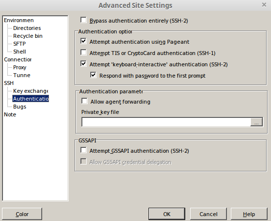

*****************
Environment Setup
*****************

This chapter deals with installing certain prerequisites to set up the 
development environment and learn some crucial tools that would make us productive.

Shell Environment
-----------------

A Shell provides us with an interface to the Unix system. Unix Shell is an environment in which we can run our commands, programs, and shell scripts. To set up a full fledged UNIX/Linux environment in Windows, we may either need 
softwares like **Ubuntu App/ GIT Bash** or Install a **virtual machine** with the Linux Operating system, however, the latter consumes a lot of resources when not backed by powerful high performance computer.

Ubuntu App
^^^^^^^^^^

The Ubuntu App is freely available to be installed in Windows on our laptops. Perfect for file management, development, remote administration, and a thousand other tasks, this is an excellent tool one can resort to for day-to-day activities.

.. image:: ../images/ubuntu.png
    :width: 400px
    :align: left
    :height: 550px
    :alt: Ubuntu App

.. note:: You will need to enable **Windows Subsystem for Linux** on your window laptops using these steps:
    
    1. Open `Turn Windows features on or off`
    2. Check the `Windows Subsystem for Linux` option

        .. image:: ../images/enable_wsl.png
            :width: 250px
            :height: 200px
            :alt: Enable WSL
        
    3. Click the `OK button and the Restart now` button

Once installed, in the Linux system, Edit/Create (if it doesn't exist) the file ``/etc/wsl.conf`` and add the following content
::

    [automount]
    root = /
    options = "metadata"

The above configuration ensures that your windows filesystems like **C:\\**, **D:\\** are mounted at **/c** and **/d** respectively on the linux filesystem.
This is particularly important for some software like Docker to work effectively.

.. seealso:: 
    1. Refer to the `WSL Configuration <https://docs.microsoft.com/en-us/windows/wsl/wsl-config>`__ for detailed information.  
    2. The instructions stated above are for WSL1. See `<https://docs.microsoft.com/en-us/windows/wsl/compare-versions>`__ for comparing the features between versions.

GIT Bash
^^^^^^^^

Git Bash is a source control management system for Windows. Git Bash is not a GUI software, it is a command-line prompt. It is used to write and run commands on the terminal.
**Download** GIT Bash from `here <https://gitforwindows.org/>`__ 

.. warning:: Although both Ubuntu App and GIT Bash can be used for Linux Environment, Ubuntu App is preferred over GIT Bash

Visual Studio Code
------------------

`Visual Studio Code IDE <https://code.visualstudio.com/>`__ is a free, lightweight, open source IDE, with support for Mac, Windows, and Linux.

Version Control
---------------
**GIT** is a version control system for tracking changes in computer files and coordinating work on those files among multiple people. 
If you are using windows, download and install git `here <https://git-scm.com/download/>`__. If you are using Linux or Mac, you can do 

.. code-block:: console

   $ sudo apt-get install git

.. note:: 
    1. If you have already installed Git Bash or Git Desktop but the git cli is not accessible by default from cmdline.
    Then, you can add the path to git.exe to your system path. Here are the paths on a recent setup
    ::
        
        %LOCALAPPDATA%\Programs\Git\git-bash.exe
        %LOCALAPPDATA%\GitHubDesktop\app-<ver>\resources\app\git\mingw64\bin\git.exe

    2. Ensure that a **Tiger Analytics** GITHub account is created. If not, collaborate with the **IT Team** to get it done.

.. _miniconda-setup:

Miniconda
---------

Install **Miniconda** on your Ubuntu app by following the below link `<https://docs.conda.io/en/latest/miniconda.html>`__

.. note::

    * If you already have `Anaconda` installed, please still go ahead and install Miniconda and use it for development.
    * If conda command is not in your path, you can configure your shell by running ``conda init``

.. _putty-setup:

Putty
-----

PuTTY is a common utility to connect to remote linux servers

Pre-requisites
^^^^^^^^^^^^^^

- You should have putty.exe. You can download it `here <https://www.chiark.greenend.org.uk/~sgtatham/putty/latest.html>`__. Get 64 bit putty.exe from "Alternative binary files" section.
- Get the Public IP address & ppk key file for your instance from IT Helpdesk

Setup
^^^^^

- Double click on putty. You should get something like the below image.

.. figure:: ../images/env_setup/02_putty_session.png
        :align: center
        :alt: putty_session

        Putty session

- In the Host Name text box type `ubuntu@\<yourip>` .
- On the left panel navigate to Connection -> SSH -> Auth and browse for ppk file. Refer below image.

.. figure:: ../images/env_setup/03_putty_key.jpg
        :align: center
        :alt: 03_putty_key

        Putty authentication

- On the left panel navigate to Session.
- In the text box below Saved Sessions, give it a name like AutoML and click save.

.. _winscp-setup:

WinSCP
------

WinSCP is a common utility to copy files to and from remote linux servers

Pre-requisties
^^^^^^^^^^^^^^

- You can download the portalbe version of WinSCP from `here <https://winscp.net/eng/downloads.php>`__.
- Get the Public IP address & ppk key file for your instance from IT Helpdesk / project leads

Setup
^^^^^

- Double click on WinSCP.exe (~18 MB file). Refer to image below.

.. figure:: ../images/env_setup/04_WINSCP_session.png
        :align: center
        :alt: 04_WINSCP_session

        WINSCP session

- In the Host Name text box type <yourip>.
- In the User name text box type ubuntu.
- Click on advanced. Then navigate to SSH -> Authentication. Refer below image.
- In the box below private key, browse for ppk file

        WINSCP authentication

- Click ok on the advanced tab. Then click Save. In the popup window give it an appropriate name.